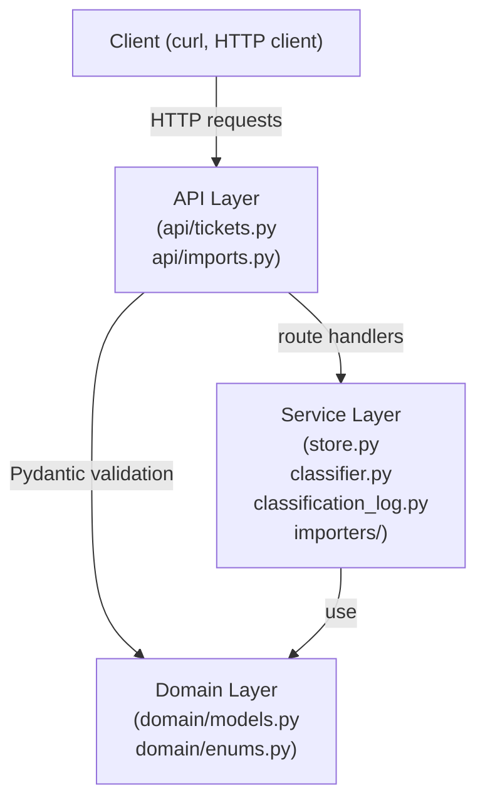
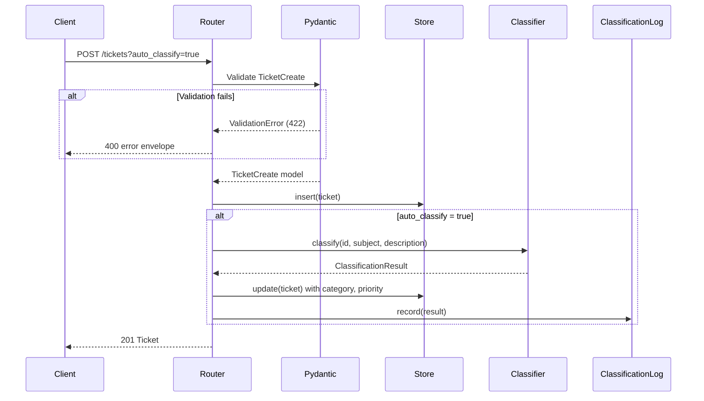

# Homework 2 Architecture — Support Tickets API

The Support Tickets API is a FastAPI-based REST service with multi-format import (CSV/JSON/XML), keyword-based auto-classification, and full CRUD. Storage is in-memory; the classifier is a pure function with no external calls.

---

## Module Architecture

**Layer rule:** `api/ → services/ → domain/`. No upward imports.

---

## Component Summary

| Module | Layer | Responsibility |
|--------|-------|---------------|
| `src/app/main.py` | App | FastAPI app, router mounts, 422→400 handler |
| `src/app/api/tickets.py` | API | CRUD + auto-classify routes |
| `src/app/api/imports.py` | API | `POST /tickets/import` (CSV/JSON/XML upload) |
| `src/app/domain/enums.py` | Domain | `Category`, `Priority`, `Status`, `Source`, `DeviceType` enums |
| `src/app/domain/models.py` | Domain | `Ticket`, `TicketCreate`, `TicketUpdate`, `ClassificationResult`, `ImportSummary` |
| `src/app/services/store.py` | Service | `InMemoryTicketStore` + `get_store()` factory |
| `src/app/services/classifier.py` | Service | Rule-based keyword classifier (pure function) |
| `src/app/services/classification_log.py` | Service | Append-only classification audit log |
| `src/app/services/importers/csv.py` | Service | `parse(bytes) → (list[TicketCreate], list[ImportError])` |
| `src/app/services/importers/json.py` | Service | Same contract as csv.py |
| `src/app/services/importers/xml.py` | Service | Same contract; uses `defusedxml` (XXE-safe) |

---

## Request Lifecycle — POST /tickets?auto_classify=true

---

## Key Design Decisions

- **In-memory store:** no DB setup; fresh instance per test via `dependency_overrides`; data lost on restart (spec-compliant).
- **Rule-based classifier:** deterministic, zero API cost, < 1 ms per call; limited semantic understanding (acceptable for demo).
- **First-match category precedence:** unambiguous; table order is the source of truth.
- **defusedxml:** prevents XXE injection on untrusted XML uploads (drop-in replacement for stdlib `xml.etree`).

---

## Further Reading

| Resource | When to use it |
|----------|---------------|
| [`docs/details/architecture/module-deep-dive.md`](./docs/details/architecture/module-deep-dive.md) | Package-by-package component descriptions |
| [`docs/details/architecture/data-flow.md`](./docs/details/architecture/data-flow.md) | Classifier decision flowchart; full request lifecycle steps |
| [`docs/details/architecture/decisions.md`](./docs/details/architecture/decisions.md) | Long-form design-decision rationale, security and performance analysis |
| [`docs/details/architecture/skeleton.md`](./docs/details/architecture/skeleton.md) | Phase-1 architecture skeleton: full module table, naming conventions, constraints |
