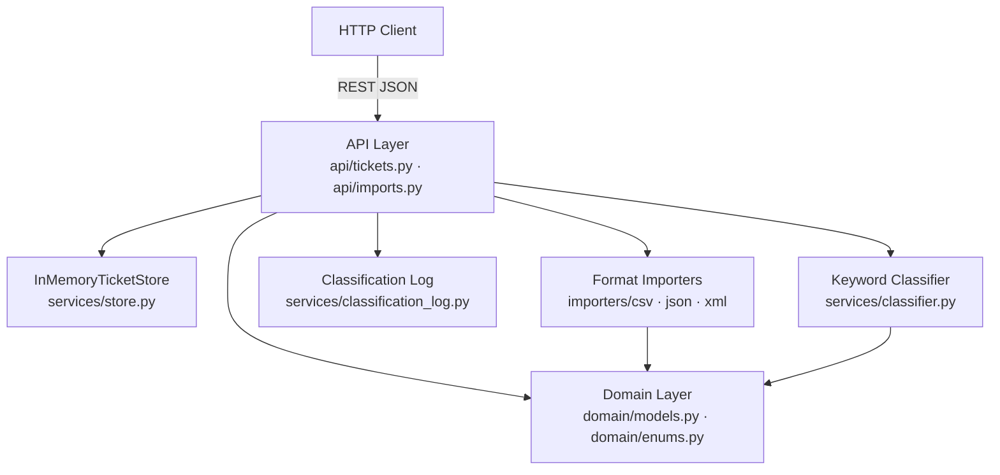

# Homework 2: Intelligent Customer Support System

**Student:** Denys Kondraiuk  
**AI Tools Used:** Claude Code (Sonnet 4.6 / Opus 4.7 subagents) — primary implementation workflow; OpenAI Codex (GPT-5) — independent review and documentation verification.

---

## Project Overview

An intelligent customer support ticket management system that imports tickets from multiple file formats (CSV, JSON, XML), automatically categorizes issues using keyword-based classification, and assigns priorities based on content analysis. Provides a REST API for ticket CRUD operations and bulk import workflows.

## Features Implemented

| Task | Description | Status |
|------|-------------|--------|
| Task 1 | Multi-format ticket import API (CSV/JSON/XML) with CRUD endpoints | ✓ Complete |
| Task 2 | Auto-classification engine with keyword-based category and priority assignment | ✓ Complete |
| Task 3 | Comprehensive test suite (100 tests, 98% line coverage) with unit, integration, and performance tests | ✓ Complete |
| Task 4 | Multi-level documentation (README, API reference, architecture, testing guide) | ✓ Complete |

## Architecture



**Layer responsibilities:**
- **API Layer** (`src/app/api/`): HTTP endpoints for ticket CRUD, bulk import, and auto-classification
- **Service Layer** (`src/app/services/`): keyword classifier, append-only classification log, in-memory store, and format-specific importers
- **Domain Layer** (`src/app/domain/`): Pydantic v2 models and string enums — the only shared contract between layers

## API Endpoints

| Method | Path | Description |
|--------|------|-------------|
| `POST` | `/tickets` | Create ticket (optional `?auto_classify=true`) |
| `GET` | `/tickets` | List all; supports `?category=`, `?priority=`, `?status=` filters |
| `GET` | `/tickets/{id}` | Get by ID |
| `PUT` | `/tickets/{id}` | Partial update |
| `DELETE` | `/tickets/{id}` | Delete |
| `POST` | `/tickets/import` | Bulk import from CSV/JSON/XML (`?format=` optional) |
| `POST` | `/tickets/{id}/auto-classify` | Run keyword classifier, update ticket |
| `GET` | `/tickets/{id}/classifications` | Retrieve classification audit log |

**Interactive API docs:** `http://localhost:3000/docs` (Swagger UI) — full schemas and try-it-out.  
**Detailed endpoint specs:** see [`API_REFERENCE.md`](./API_REFERENCE.md).

## AI Tools Used

| Document | Model | How produced |
|----------|-------|--------------|
| `README.md`, `HOWTORUN.md` | **Claude Sonnet 4.6** | Written directly by the orchestrating Claude Code session |
| `API_REFERENCE.md` | **Claude Opus 4.7** | Produced by a specialized API-documenter subagent |
| `ARCHITECTURE.md` | **Claude Opus 4.7** | Produced by a specialized architect subagent |
| `TESTING_GUIDE.md` | **Claude Opus 4.7** | Produced by a specialized QA-documenter subagent |
| Documentation review | **OpenAI Codex (GPT-5)** | Independent review of requirement coverage and wording |

**Implementation and tests** (`src/`, `tests/`) were produced by Claude Opus 4.7 subagents under a TDD workflow orchestrated by Claude Sonnet 4.6. OpenAI Codex was used afterward as a second-review tool.

## How to Run

```bash
cd homework-2
bash demo/run.sh       # starts server at http://localhost:3000
```

For detailed setup, test commands, and curl examples see [`HOWTORUN.md`](./HOWTORUN.md).

## Documentation Map

| File | When to read it |
|------|-----------------|
| `README.md` | Project overview (this file) |
| `HOWTORUN.md` | Installing, running the server, running tests, sample curl commands |
| `API_REFERENCE.md` | Endpoint summary, schema tables, error envelope |
| `ARCHITECTURE.md` | System design, Mermaid diagrams, design decisions |
| `TESTING_GUIDE.md` | Test pyramid, how to run tests, coverage report, benchmarks |
| `docs/details/` | Deep-dive appendices for API, architecture, testing, and design specs |

## Submission Checklist

- [x] All four tasks implemented and documented
- [x] 100 tests, 98% line coverage
- [x] Five documentation files: `README.md`, `HOWTORUN.md`, `API_REFERENCE.md`, `ARCHITECTURE.md`, `TESTING_GUIDE.md`
- [x] ≥3 Mermaid diagrams across documentation (5 total: 1 in README, 3 in ARCHITECTURE, 1 in TESTING_GUIDE)
- [x] `docs/screenshots/test_coverage.png` present (98% coverage report)
- [x] Demo files: `sample_tickets.csv` (50 rows), `sample_tickets.json` (20 rows), `sample_tickets.xml` (30 rows)
- [x] AI tools attribution table documents which model produced each deliverable
- [x] PR on `homework-2-submission` branch against `main` on student fork
