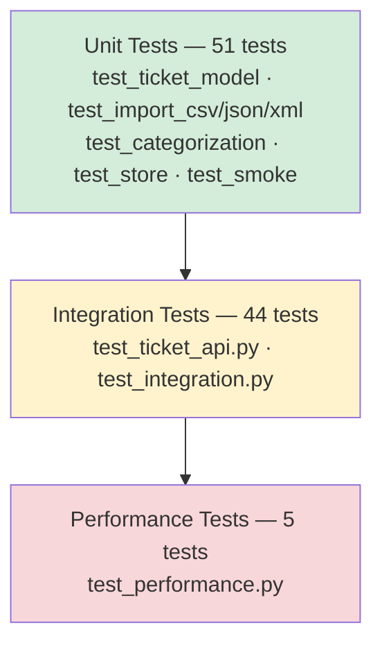

# Testing Guide

100 tests achieving **98% line coverage**. The suite validates the full stack: Pydantic model constraints, multi-format import parsing, the full API lifecycle, and auto-classification logic.

---

## Test Pyramid



---

## How to Run Tests

```bash
cd homework-2

uv run pytest -v                                    # all tests
uv run pytest tests/unit/ -v                        # unit tests only
uv run pytest tests/integration/ -v                 # integration tests only
uv run pytest --cov=app --cov-report=term-missing  # with coverage summary
uv run pytest --cov=app --cov-report=html          # HTML report → htmlcov/index.html
uv run pytest -k "csv" -v                           # tests matching keyword
uv run pytest -x                                    # stop at first failure
```

Expected: **100 passed**, 0 failed, **98% line coverage**.

### macOS readline segfault workaround

```bash
TERM=dumb uv run pytest -p no:terminal -q --tb=short
```

---

## Test File Reference

| File | Count | Layer | What it tests |
|------|-------|-------|---------------|
| `test_ticket_model.py` | 9 | Unit | Pydantic validation: required fields, email, lengths, enums, extra-field rejection |
| `test_import_csv.py` | 6 | Unit | CSV parser: valid rows, empty file, missing columns, invalid rows, tag splitting, metadata flattening |
| `test_import_json.py` | 6 | Unit | JSON parser: valid array, empty array, non-array root, invalid rows, non-dict elements, malformed JSON |
| `test_import_xml.py` | 6 | Unit | XML parser: valid XML, empty `<tickets>`, malformed XML, tags wrapper, metadata wrapper, missing required fields |
| `test_categorization.py` | 15 | Unit | Keyword classifier: all priority levels, all categories, fallbacks, confidence formula, edge cases |
| `test_store.py` | 3 | Unit | Store filters by category, priority, combined |
| `test_smoke.py` | 1 | Unit | App bootstraps; all routers registered |
| `test_ticket_api.py` | 28 | Integration | Full CRUD, import formats, error codes (400/404/422→400), auto-classify endpoints, log persistence |
| `test_integration.py` | 5 | Integration | End-to-end workflows: lifecycle, bulk-import+auto-classify, concurrent creates, combined filters |
| `test_performance.py` | 5 | Performance | Throughput benchmarks (see table below) |

---

## Performance Benchmarks

| Benchmark | Threshold | Actual | Margin |
|-----------|-----------|--------|--------|
| Import 50-row CSV | < 500 ms | 28.7 ms | 17× under |
| List 1000 tickets | < 200 ms | 17.7 ms | 11× under |
| Classify single ticket | < 50 ms | 2.9 ms | 17× under |
| 20 concurrent creates | < 2 s | 46.2 ms | 43× under |
| Import 30-row XML | < 750 ms | 14.5 ms | 52× under |

All in-process (TestClient, no network), macOS, Python 3.11.

```bash
uv run pytest tests/integration/test_performance.py -v --durations=0
```

---

## Further Reading

| Resource | When to use it |
|----------|---------------|
| [`docs/details/testing/unit-tests.md`](./docs/details/testing/unit-tests.md) | Sample data file locations; per-module coverage breakdown |
| [`docs/details/testing/integration-tests.md`](./docs/details/testing/integration-tests.md) | Step-by-step manual testing checklist (all endpoints, all import formats) |
| [`docs/details/testing/performance-tests.md`](./docs/details/testing/performance-tests.md) | Test isolation fixture design; CI/CD configuration; test naming conventions |
