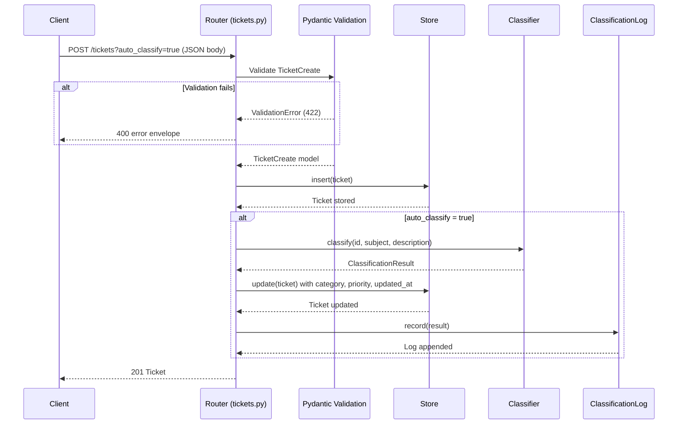
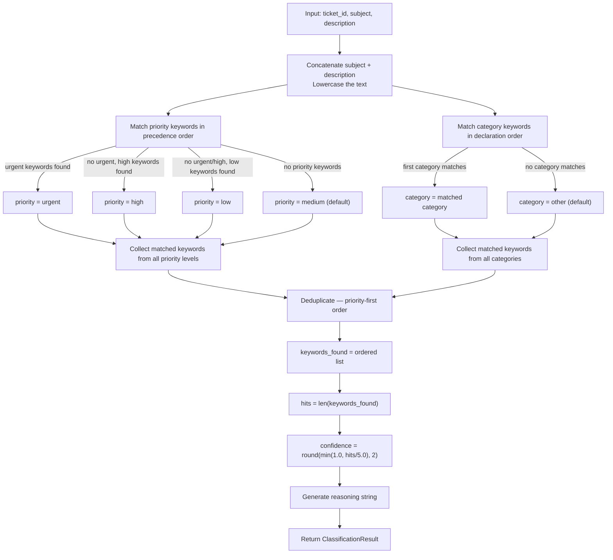

# Data Flow — Classifier Decision and Request Lifecycle

## POST /tickets?auto_classify=true — Request Lifecycle

### Step-by-step

1. Client sends POST with `TicketCreate` JSON and optional `?auto_classify=true`.
2. FastAPI validates the JSON (`extra="forbid"` rejects unknown fields). Invalid query params caught here.
3. If validation fails → 422 → central handler converts to 400 with standard envelope.
4. Router creates `Ticket` with auto-generated UUID and current UTC timestamp.
5. Router inserts ticket into store.
6. If `auto_classify=true`: classifier invoked → `ClassificationResult` returned → ticket `category`, `priority`, `updated_at` patched → store updated → result logged.
7. Router returns 201 with the ticket.

### POST /tickets/{ticket_id}/auto-classify — Steps

1. Client sends POST with a valid UUID path parameter.
2. Router fetches the ticket from the store; returns 404 if not found.
3. Router invokes the classifier.
4. Router updates the ticket's `category`, `priority`, and `updated_at`.
5. Router records the classification result in the log.
6. Router returns 200 with the `ClassificationResult` (not the full Ticket).

---

## Classifier Decision Flow

